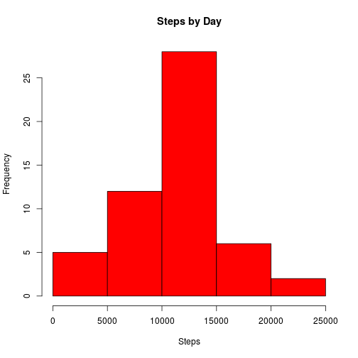
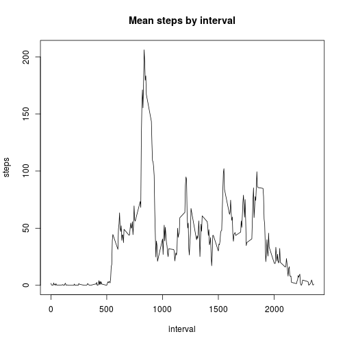
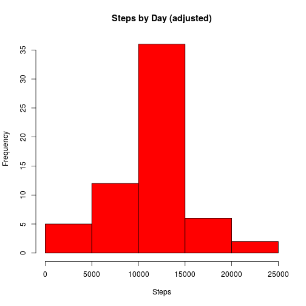
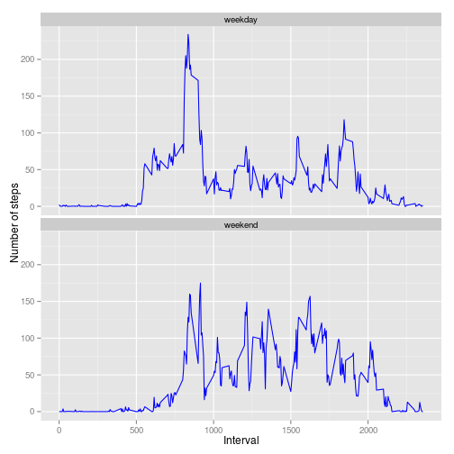

This markdown file describes the analysis performed for the first project of the course "Reproducible Research" at Coursera.

## Loading and preprocessing the data

First we load the data assuming the working directory contains the file either being previously unzipped or not. If no file is present then it's downloaded from the internet.


```r
if(file.exists("activity.csv")){
    activity <- read.csv("activity.csv", stringsAsFactors=FALSE)
} else{
    if(!file.exists("activity.zip")){
        url <- "https://d396qusza40orc.cloudfront.net/repdata%2Fdata%2Factivity.zip"
        download.file(url, "activity.zip", method="curl")
    }
    activity <- read.csv(unz("activity.zip", "activity.csv"), stringsAsFactor=FALSE)
} 
```

Then we reformat the date column and create a new column as a time series.


```r
activity$date <- as.Date(activity$date,"%Y-%m-%d")
activity$time <- strptime(paste(activity$date, sprintf("%04d", activity$interval)),"%Y-%m-%d %H%M")
```

## What is mean total number of steps taken per day?

The following code creates a summary of the steps taken by day and calculate some central tendency statistics.


```r
daySteps <- xtabs(steps ~ date, data=activity)
stepsMean <- mean(daySteps, na.rm=TRUE)
stepsMedian <- median(daySteps, na.rm=TRUE)
options(scipen = 1, digits = 2)
```

The mean is 10766.19 and the median 10765. A histogram of the data is presented here.


```r
hist(daySteps, col="red", main="Steps by Day", xlab="Steps")
```

 

## What is the average daily activity pattern?

The daily activity pattern by 5 minute interval is presented in the graph below.


```r
intervalSteps <- aggregate(steps ~ interval, data=activity, mean)
with(intervalSteps, plot(interval, steps, type="l", main="Mean steps by interval"))
```

 

```r
maxSteps <- max(intervalSteps$steps)
maxInterval <- intervalSteps$interval[intervalSteps$steps==maxSteps]
```

A peak is observed at the 835 interval with a mean value of 206.17.

## Imputing missing values


```r
naCount <- sum(is.na(activity$steps))
naDays <- length(unique(activity$date[is.na(activity$steps)]))
```

There are 2304 missing values in the data recorded in 8 different days.

A new column is created with the same values of the steps column but with the missing data replaced with the mean of the corresponding interval.


```r
activity$stepsNew <- activity$steps
idx <- is.na(activity$stepsNew)
activity$stepsNew[idx] <- intervalSteps$steps[match(activity$interval[idx], intervalSteps$interval)]
```

To see the impact of this data filling strategy on the daily total number of steps a similar analysis is performed.


```r
dayStepsNew <- xtabs(stepsNew ~ date, data=activity)
stepsMeanNew <- mean(dayStepsNew, na.rm=TRUE)
stepsMedianNew <- median(dayStepsNew, na.rm=TRUE)
hist(dayStepsNew, col="red", main="Steps by Day (adjusted)", xlab="Steps")
```

 

The mean of the filled data is 10766.19 and the median is 10766.19. As we can see the mean value is not changed but the median is now the same as the mean.

## Are there differences in activity patterns between weekdays and weekends?

To see differences in activity patterns between weekdays and weekends a factor is created separating the data in two groups according to the day of the week and the daily patterns are presented in the following graph.


```r
activity$dayType <- "weekday"
activity$dayType[activity$time$wday==0 | activity$time$wday==6] <- "weekend"
activity$dayType <- as.factor(activity$dayType)
intervalStepsNew <- aggregate(steps ~ dayType + interval, data=activity, mean)
require(ggplot2)
g <- ggplot(intervalStepsNew, aes(interval, steps))
g <- g + labs(x="Interval", y="Number of steps")
g <- g + geom_line(color="blue")
g + facet_wrap(~dayType, nrow=2)
```

 

We can see a different pattern in the weekends where the peak is not as pronounced as in the weekdays and the walking activity begins at later hours.


